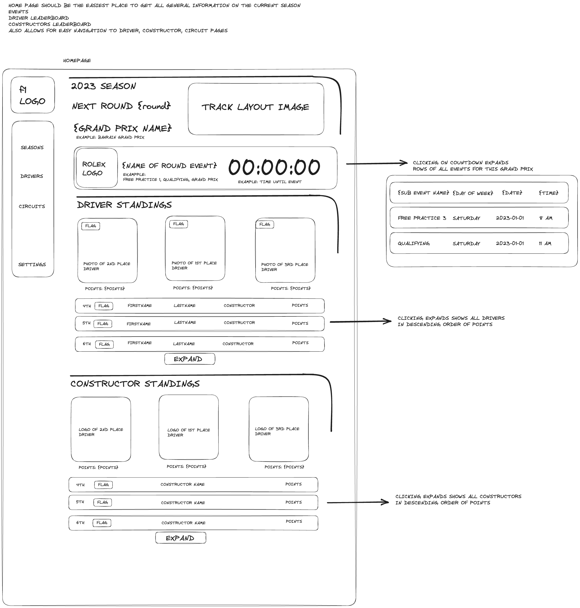
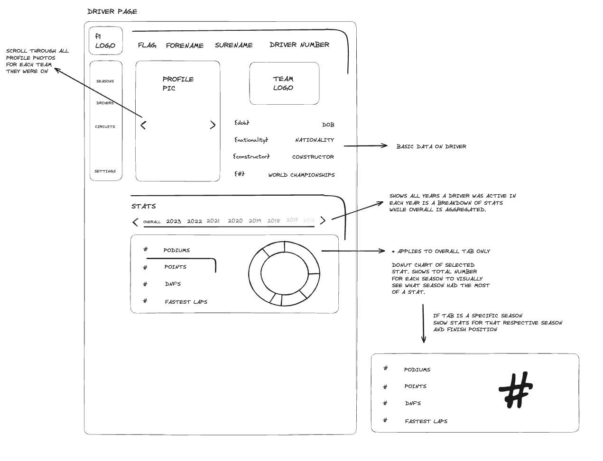

# MARC DALLAS APP

## TABLE OF CONTENTS
* [About](#about)
* [Local Installation](#local-installation)
* [Running](#running)
    *   [IN BROWSER](#in-browser)
    *   [IN DESKTOP](#in-desktop)
* [Design](#design)
    *   [HOMEPAGE](#homepage)
    *   [DRIVER PAGE](#driver-page)
* [CONTRIBUTORS](#contributors)

## ABOUT
description

## LOCAL INSTALLATION
Installed npm packages
> npm i

## RUNNING

### In Browser
> npm run dev

### In Desktop
> npm run tauri dev

## DESIGN

### HOMEPAGE
Description

### DRIVER PAGE
Description

## CONTRIBUTORS
*   [Kevin Yatsinko](https://github.com/okni-c)
*   [Marc Ebersberger Jr](https://github.com/BlueMonkeyQ)